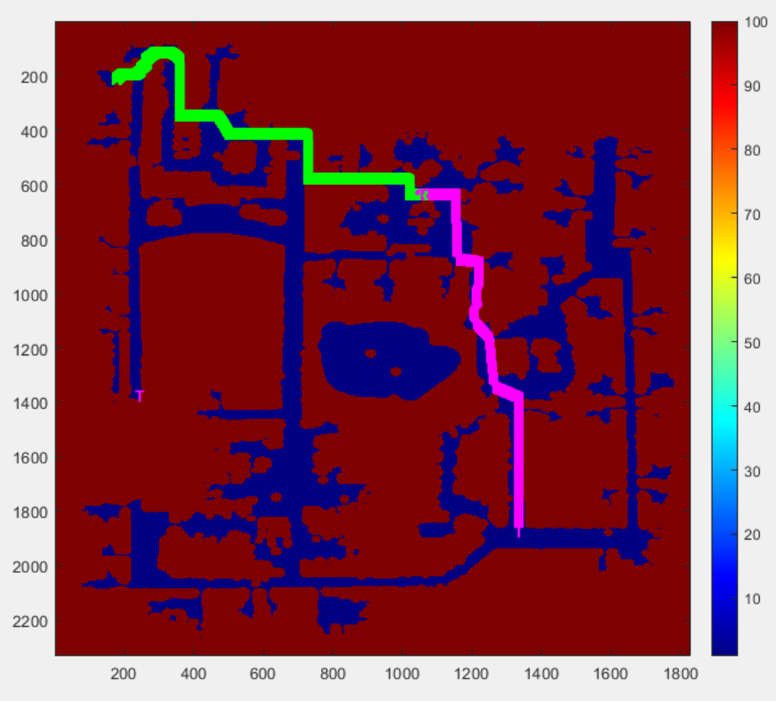
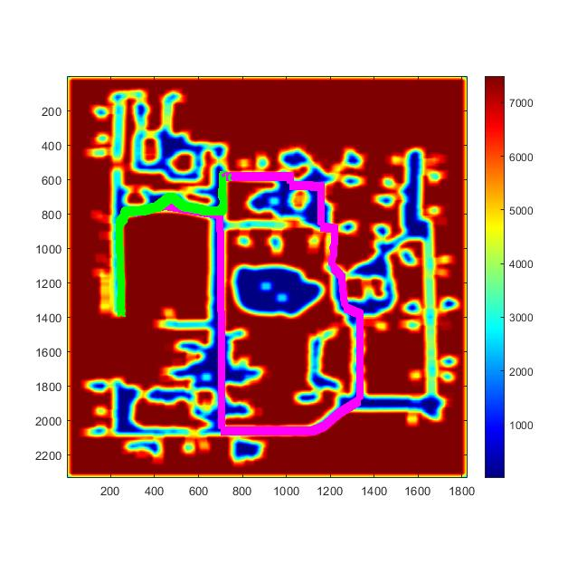
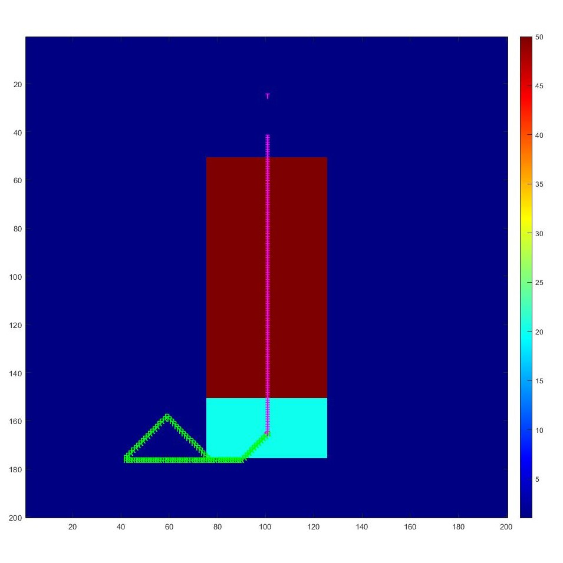

# 16782 Planning and Decision Making in Robotics - Catch me if you can

Author: Meghdeep Jana (mjana) \
Created: September 21, 2021 3:00 PM \
Last Edit: October 3, 2021 6:42 PM

## Academic Integrity
If you are currently enrolled in the Graduate 16-782 Planning and Decision Making in Robotics, or the Undergraduate 16-350 Planning Techniques for Robotics course at Carnegie Mellon University, please refer to CMUs Academic Integrity Policy before referring to any of the contents of this repository.

## 1 OBJECTIVE

The task for the planner is to generate a path for the robot that will allow it to catch the object with the least cost incurred.

## 2 PLANNER

### 2.1 Code Specifics

to compile the code use the following command: `mex planner.cpp`

- `unordered_map<array<int,3>, cell, ArrayHasher> grid`for storing the implicit graph , a hasher function to hash array keys
- `unordered_map<array<int,3> , bool, ArrayHasher> closed` for closed.  Hashmap was used for the implicit graph and closed list because of the lookup time complexity of $O(1)$
- `struct ArrayHasher {}` is a hashing function used in `unordered_map` for storing implicit graph and closed list with an array of size 3 as the key.
- `typedef pair<int, vector<int>> listPair` define a datatype. the first entry of the `pair`, which is the f-value of the cell `(x,y,t)`. The `(x,y,t)` is the second entry of the `pair` which is a vector of size three.
- `priority_queue<listPair, vector<listPair>, greater<listPair>> open` (min-heap) was used for open list.  I was in a dilemma between `set` and`priority_queue` Even though `set` handles duplicate entries and we can access any element to update the `f` value in the open list of cells already added to it. The operation of inserting to `priority_queue`is faster than on a `set`, which would optimize better for time. I have instead used a simple loop to handle duplicate entries in the `priority_queue`
- I've used the equivalent 2D forms of these data structures for the 2D Djikstra search.
- `stack<pair<int, int>> Path` to trace the planned path, the pair is `(x,y)`. As the trace of the path starts from the `target_pose`, a LIFO data structure is suitable to get the sequence of `robot_pose` for the path. This is defined as a global variable.
- `queue<pair<int,int>> Path2d` to trace the 2D planned path, the pair is `(x,y)`. I have used a backward search for 2D, the trace will start from the `robot_pose`, so a FIFO data structure is suitable. This is defined as a global variable.
- `struct cell{}` is the value in the implicit graph hashmap, it stores `f,g,h` values of the cell that are ints, and the parent cell (array of size 3: `(x,y,t)`)  that made the last `g`update.
- `vector<vector<cell2d>> grid2d` of size `(x_size,y_size)` to store the 2D explicit graph
- `struct cel2d{}` is the equivalent cell for the 2D search. The only difference is that the parent cell is a `pair<int,int>.`
- `bool isValid()` function checks if the cost of particular cell in the map is valid or is above the collision threshold
- `vector<int> search_2d()` function performs the 2D Multigoal backwards Djikstra. This function is used both to get the heuristic for the 3D search and as a backup path in-case the 3D search fails to find a plan
- `vector<int> getPath()` function traces the 3D graph to find the states in the planned path and stores in it in `Path` stack.
- `vector<int> getPath2d()` function traces the 2D graph to find the states in the planned path and stores in it in `Path2d` queue

### 2.1 The procedure

- Weighted 3D A* `(x,y,t)` was used to plan the path to catch the target.
- Implicit graph expansion was 9 connected. `(x1,y1,t)`’s successors were `(x1,y1,t+1)` and the 8 connected 2D neighbors of `(x1,y1)` at time `t+1`.
- I kept track of `time_elapsed` since `curr_time` while planning. `time_elapsed` was utilized in the goal function. A `buffer_time` (that scales with size of the map) is added to the `time_elapsed` to take into account the overhead for calling the planner, tracing the path etc. 
`buffer_time = 5* MAX(x_size,y_size)/200`
- Then goal condition is achieved 
`if (x,y)==target_traj[MIN(curr_time+t+time_elapsed, target_steps-1]`  ,
where `(x,y,t)` is the node being expanded
- `h(x,y,t)= $\epsilon$* g_2d(x,y)` where `g_2d` is the cost to goal found by **2D Multi-goal backwards Djikstra**. ****For the 2D Djikstra, I utilized the whole map as the explicit graph and set all `g(x,y)=INT_MAX` except the cells that are in the **second half of the target trajectory**, which were all set to `g(x,y)=0` and added to the initial open list. I’ve not used the first half of the target trajectory as a realistic assumption of potential intercept points, so that the 3D search doesn’t expand to those states and slow down the search. Instead of exiting the 2D search at the `robot_pose` (goal pose for backward search), I continued the search till the `open_list` was empty to achieve maximum coverage for the `g(x,y)` value to update for the cells. At the end of the 2D Dijkstra, the corresponding `g(x,y)` values were such that, from any`(x,y)`in the map, `g(x,y)` gave the optimal cost to any of the potential goal states. As I wanted the 3D search to expand towards these potential goal states, this heuristic is able to provide that information to a good enough extent.
- To reduce the number of expansions in the search, the weighted heuristic was used and the search did not allow re-expansions. I experimented with epsilon values of 2,3,5 and 10. I found $`\epsilon = 2`$ to give the best optimality to expansion trade-off. For $`\epsilon=1`$, the search was not fast enough to catch the target in map 1 and for higher values, the path cost for map4 and 2 were too high.
- For 3D search, this heuristic is both admissible and consistent. So the path obtained from this planner would be $\epsilon-suboptimal$ with  $\epsilon=2$. 
$cost(solution)<= 2*cost(optimal)$
- Once the planner has found the path, it is stored in a globally defined `stack`. On subsequent calls to the planner function, the planner pops the next element in the `stack` and returns it to Matlab directly. I have defined a boolean `have_path` to check if the planner has a path to the target.
- If the planner gets `curr_time=0` as a parameter, it resets the variables and clears the memory from created variables. It will then search for the given map.
- Another boolean `found_path` flags if the 3D search has found the path to the target under the specified time frame (`target_steps`). If `found_path` is false, it will use the 2D Djikstra search as backup path. The boolean `better_2d` keeps track if the planner should return the 2D plan (for `true` ) or not.
- The backup path is to use 2D Djikstra to reach the last pose in the `target_traj` and then trace the trajectory in reverse to intercept the target somewhere in its trajectory.

## 3 APPROACHES TRIED

- 2D A*
    - Goal function: If `(x,y)` is same as last pose in `target_traj` ; `(x,y)` is the cell being expanded
    - Heuristic: Octal distance to last pose in `target_traj`
    - The planner searches at each call made to the planner.cpp
    - **Cons**: Maybe we can intercept it before that, cost was high, doesn't work for most of the maps
- 2D A* (chase the future)
    - Two integer variables introduced, `dist_to_goal` which is the Euclidean distance from the robot to target; `future= 0.1*dist_to_goal`
    - Goal function: If `(x,y)` is same as `target_tra[curr_time + future]` ; `(x,y)` is the cell being expanded. The robot shoots towards a future `target_pose` and the future horizon gets shorter as the robot moves closer to the target, eventually shooting towards the target for `dist_to_goal < 10` and intercepting the target
    - Heuristic: Octal distance to`target_tra[curr_time + future]`
    - The planner searches at each call made to the planner.cpp
    - **Cons:** The planner worked for all maps except map 5. But the very high costs for map 2, 4 and 6.

It was evident that 2D search was not the appropriate choice for this problem, so I started implementing 3D search `(x,y,t)`. Instead of planner searching for each call made to the planner, planner plans once in 3D and stores the plan globally for subsequent calls to the planner.

- 3D A* with weighted octal
    - Goal function: If `(x,y)` is same as  `target_traj[curr_time+t+time_elapsed]` ; `(x,y,t)` is the cell being expanded
    - Heuristic: Weighted Octal distance to `target_traj[curr_time+t+time_elapsed]`
    - The 3D now worked for map 5, but the costs were still high and the planners were slow for some of the bigger maps.
    - **Cons**: Octal/eucledian etc bad choices as they don’t include the cost of the cell but are distance-based. These resulted in very high costs of the path. Need to think of a heuristic that includes cost of the cell and also drive the expansion towards potential goal states
- 3D A* with 2D backward Djikstra as heursitic
    - Similar to the explained planner but the issue was with initializing the g-values in 2D search.
    - First, I tried to keep last post in target_traj as the goal for backwards Djikstra
    **Cons:** The expansion was biased towards catching the target at the end
    - I was exiting the search as soon as the search expanded **`robot_pose`**
    **Cons**: not all nodes had updated g values that were expanded in the 3D search, causing some heuristic values to be `INT_MAX` causing the search to fail
- 3D A* with 2D multi-goal backward Djikstra as heursitic (final method explained above that worked well)

## 4 RESULTS

- Map 1

- Map 2
    
    
    
- Map 3

- Map 4

- Map 5

- Map 6
    
    
